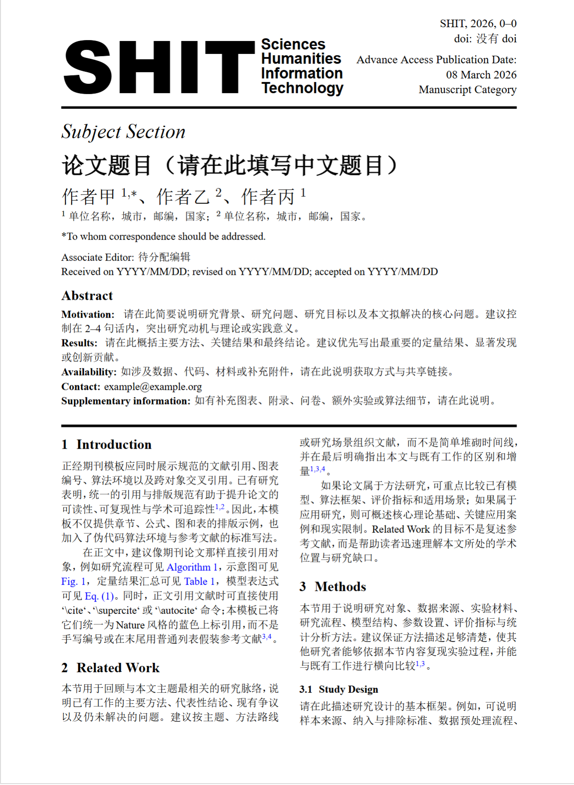

<div align="center">
  
  <h1>SHIT Journal LaTeX Template</h1>
  <p><strong>S.H.I.T. = Sciences · Humanities · Information · Technology</strong></p>
  <p>构石期刊 LaTeX 模板<br>A bilingual academic article template for the fictional journal <strong>SHIT / 构石</strong></p>
  <p>
    
    
    
    
    
  </p>
  <p>
    <a href="#about">About</a> •
    <a href="#features">Features</a> •
    <a href="#quick-start">Quick Start</a> •
    <a href="#build">Build</a> •
    <a href="#license">License</a>
  </p>
</div>

---

<a id="about"></a>

## About

This repository contains the LaTeX template for the fictional journal **SHIT / 构石**.
It is designed for a clean, journal-like manuscript workflow with bilingual support, a customized first page, structured abstract blocks, standardized cross-references, and a Nature-style bibliography pipeline.

The template is based on `ctexart` and currently includes:

- English text in `Times New Roman`
- Chinese text in `SimSun`
- Nature-style references via `biblatex + biber`
- Blue superscript citation numbers in the main text
- Examples for figures, tables, equations, algorithms, acknowledgements, AI statement, funding, and references

<a id="features"></a>

## Features

### Journal-style front page

- Custom SHIT masthead
- Subject section line
- Title, authors, affiliations, abstract, and metadata arranged like a journal article

### Writing-ready manuscript body

- `Introduction`
- `Related Work`
- `Methods`
- `Results`
- `Discussion`
- `Conclusion`

### Standard academic components

- Figure example with `./fig/` asset convention
- Table example
- Pseudocode example using `algorithm` + `algpseudocode`
- Equation example
- Cross-reference examples for figure/table/algorithm/equation
- AI statement block similar to publisher disclosure sections

### Citation workflow

- Bibliography entries stored in `references.bib`
- Nature-style numbered references
- Blue superscript in-text citations

---

## Repository Layout

```text
SHIT/
├─ fig/
│  ├─ README.txt
│  └─ SHIT.png
├─ references.bib
├─ shit_journal_template.tex
├─ LICENSE
├─ .gitignore
└─ README.md
```

---

<a id="quick-start"></a>

## Quick Start

1. Edit `shit_journal_template.tex`.
2. Put all manuscript figures into `./fig/`.
3. Maintain bibliography data in `references.bib`.
4. Compile with XeLaTeX + Biber.

---

<a id="build"></a>

## Build

Use the following compilation sequence:

```bash
xelatex shit_journal_template.tex
biber shit_journal_template
xelatex shit_journal_template.tex
xelatex shit_journal_template.tex
```

If you are using an editor workflow, make sure the PDF preview is refreshed after rebuilds, especially after updating figures.

---

## Writing Rules

- Put all figure files under `./fig/`.
- The figure example in the template checks `./fig/SHIT.png`.
- Bibliography entries should be written in `references.bib`.
- The template already maps default citation commands to Nature-style blue superscripts.

---

<a id="license"></a>

## License

This project is released under the **MIT License**.  
See [LICENSE](./LICENSE) for details.

---

<div align="center">
  <sub><i>"Truth Fades, S.H.I.T Lasts."</i></sub>
  <br>
  <sub><i>"真理会过时，构石永恒。"</i></sub>
</div>
